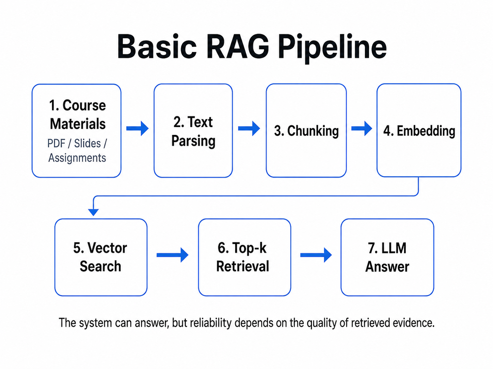

# What I Learned from Building a RAG System

> The hardest part was not making the LLM answer better.  
> It was making the system answer with the right evidence.

## 1. Background

I recently reviewed the process of building a course-material RAG system.

The original goal was simple: I wanted to build an AI assistant that could answer questions based on course PDFs, slides, and assignment materials.

Instead of manually searching through dozens of pages, a student could ask a question and get an answer grounded in the provided course materials.

However, that word -- **grounded** -- is where the real difficulty begins.

At first, I thought the main challenge was making the LLM generate better answers. After testing the system repeatedly, I realized that the real bottleneck was not generation.

It was:

- retrieval quality
- ranking quality
- citation accuracy
- refusal behavior
- evaluation

In other words, the problem was not simply whether the model could answer. The real question was whether the answer could be traced back to the correct evidence.

---

## 2. The First Version

The first version followed a standard RAG pipeline:

1. Parse course documents
2. Split them into chunks
3. Convert chunks into embeddings
4. Store them in a vector index
5. Retrieve top-k relevant chunks for each user question
6. Send the retrieved context to an LLM
7. Generate the final answer

At this stage, the system could already answer some questions.

But I quickly learned an important lesson:

> A system that can answer is not necessarily a system that can answer reliably.

This difference became the main theme of the project.

---

## 3. Early Failure Modes

The first obvious failure mode was that the system sometimes answered:

> I don't know.

At first, I thought the model was too conservative, or that the prompt was not good enough.

But after checking the retrieved chunks, I found that in many cases, the LLM had not received the correct evidence at all.

The problem started before generation.

A more dangerous failure mode was subtler.

Sometimes the system retrieved something that looked relevant, but was not actually the right evidence.

For example, a user might ask for the definition of a concept. The retrieved chunk contained the keyword, but it was only an example, a side note, or an incomplete context.

The LLM then generated a fluent answer based on weak evidence.

That kind of answer is dangerous because it looks reasonable, but it is not truly grounded.

---

## 4. Why Retrieval Matters More Than I Expected

This changed how I think about RAG.

A RAG system has at least four layers:

1. Did we retrieve the right evidence?
2. Did we rank the best evidence near the top?
3. Does the final answer actually match the source?
4. Is the language clear and useful?

At the beginning, I focused too much on the fourth layer: answer fluency.

But most real failures happened in the first three layers.

If the right chunk is not retrieved, the model cannot answer correctly.

If the right chunk is retrieved but ranked too low, it may still be ignored.

If the answer is fluent but the citation does not support the claim, the system is not reliable.

This is why I stopped treating RAG as simply "LLM + knowledge base."

A more accurate description is:

> RAG is an evidence management problem.

---

## 5. Chunking and Preprocessing

I started tuning chunk size and overlap.

If chunks are too large, each vector may contain too much unrelated information. Retrieval becomes noisy.

If chunks are too small, definitions and context may be broken apart. The system may retrieve incomplete evidence.

This was one of my first practical lessons:

> Many RAG errors are not model intelligence problems. They are data preprocessing problems.

If the knowledge is cut badly, even a strong LLM cannot fully recover.

This also made me realize that before improving prompts or changing models, I should first inspect the data pipeline:

- How are documents parsed?
- How are chunks created?
- Are definitions kept intact?
- Are irrelevant headers, footers, or repeated text removed?
- Does each chunk contain enough context to be useful?

---

## 6. Retrieval Tuning

I also experimented with retrieval-related settings and methods, including:

- top-k
- fetch-k
- MMR
- BM25
- reranking

I do not see these as magic solutions. They solve different problems.

`top-k` controls the balance between recall and noise.

If top-k is too small, the system may miss the correct evidence. If top-k is too large, the LLM receives too much irrelevant context.

MMR helps reduce repetitive retrieved chunks and improves diversity.

BM25 is useful for keyword-heavy queries, especially when the question contains technical terms or course-specific vocabulary.

Rerankers help reorder retrieved candidates so that more relevant chunks appear near the top.

The key lesson is:

> Before applying a technique, I need to understand which failure mode I am trying to fix.

If the retrieved evidence is correct but the model goes beyond it, the issue is more related to prompting, grounding, or citation constraints.

---

## 7. From Fluent Answers to Grounded Answers

A turning point was separating the output into two parts:

1. raw retrieved evidence
2. rewritten answer

The raw evidence allowed me to inspect what the system actually found.

The rewritten answer showed how the LLM interpreted and summarized that evidence.

This made the gap visible.

Sometimes the answer was fluent, but not fully supported by the raw evidence.

The model was not always completely hallucinating. In many cases, it slightly expanded the evidence, connected it with general knowledge, or made the answer sound more complete than the source allowed.

This is a subtle but important problem.

For a general chatbot, this may be acceptable.

For a course-material RAG system, it is risky.

The system should answer based on the provided materials, not based on a mixture of retrieved evidence and the model's general knowledge.

This led me to one of my most important takeaways:

> Fluency is not faithfulness.

---

## 8. Citation Accuracy

Citation accuracy became one of my biggest concerns.

A RAG answer should not only sound correct.

It should answer a stricter question:

> Can this claim be traced back to the source?

If the answer looks polished but the citation does not actually support it, the system is not reliable enough.

This is especially important in scenarios such as:

- education
- law
- medicine
- finance
- internal knowledge bases
- technical documentation

In these cases, the value of RAG is not only that it generates an answer. The value is that the answer is grounded in verifiable evidence.

A good RAG system should make it easy to inspect:

- which source was used
- which chunk supported the answer
- whether the answer goes beyond the source
- whether the citation is strong or weak

---

## 9. Refusal Behavior

I also added a "not covered by the provided materials" behavior.

This may sound less exciting than retrieval, reranking, or generation, but I think it is essential.

A reliable RAG assistant should not answer everything.

It should know:

- what is covered by the materials
- what is not covered
- what can be answered partially
- when it should refuse to answer

In RAG, refusal is not a weakness.

It is part of reliability.

If the provided materials do not contain enough evidence, the system should not pretend that it knows the answer.

This is a major difference between a normal chatbot and a grounded knowledge assistant.

A chatbot tries to respond.

A reliable RAG system should respond only when there is enough evidence.

---

## 10. Multi-document RAG

The system became harder to control when I moved from a small number of documents to multiple PDFs, slides, and assignment files.

The same concept may appear in different files.

One source may define it.  
Another may only use it as an example.  
Another may mention it in an assignment requirement.

The system must not only find something relevant.

It must find the right source for the current question.

This is where multi-document RAG becomes closer to real-world knowledge-base search.

Real knowledge bases are messy.

Information is distributed across different formats, documents, and contexts.

This made me pay more attention to source ranking, citation quality, and question intent.

---

## 11. Badcase Analysis

After seeing these failures, I started doing badcase analysis.

Whenever the system failed, I stopped looking only at the final answer.

Instead, I checked the whole chain:

- Was the right chunk retrieved?
- If yes, why was it not ranked higher?
- Did the answer go beyond the raw evidence?
- Did the citation actually support the claim?
- Should the system have refused to answer?
- Did different question types need different answer strategies?

This was much more useful than simply rewriting prompts.

Prompting matters, but many failures happen before the prompt is even useful.

Badcase analysis helped me locate the actual source of the problem.

Sometimes the issue was chunking.  
Sometimes it was retrieval.  
Sometimes it was ranking.  
Sometimes it was citation.  
Sometimes it was refusal behavior.  
Sometimes it was answer formatting.

This process made the system much easier to reason about.

---

## 12. Evaluation Framework

Over time, I started thinking in terms of evaluation metrics instead of saying:

> The result looks good.

The metrics I care about now include:

### Retrieval Hit Rate

Did the system retrieve the right source?

If the correct evidence is not retrieved, the answer cannot be reliably grounded.

### Ranking Quality

Was the best evidence near the top?

A correct chunk buried too low may still be useless.

### Citation Accuracy

Does the citation actually support the claim?

This is critical for trustworthiness.

### Refusal Accuracy

Does the system stop when evidence is insufficient?

A grounded system should not answer out-of-scope questions confidently.

### Answer Relevance

Does the final answer solve the user's question?

Even if the evidence is correct, the final answer still needs to be useful.

This framework helped me see RAG reliability as a multi-layer problem.

It is not enough to evaluate the final answer only.

We need to evaluate the entire evidence pipeline.

---

## 13. Query Understanding

I also realized that different question types need different strategies.

Definition questions need short, precise, source-grounded answers.

Comparison questions need evidence for both sides.

Assignment-related questions must strictly follow the provided materials.

Out-of-scope questions should trigger refusal.

This made me realize that RAG is not only retrieval plus generation.

It also needs query understanding.

A fixed RAG pipeline may treat all questions the same way, but real user questions have different intents.

For example:

- "What is regression?" is a definition question.
- "What is the difference between A and B?" is a comparison question.
- "What should I submit for this assignment?" is a requirement lookup question.
- "What does the course say about something not in the materials?" may require refusal.

Handling these intents properly can make the system more useful and safer.

---

## 14. Main Takeaways

Looking back, the biggest lesson was not simply:

> I built a RAG demo.

The real lesson was understanding what makes an AI application reliable.

It is not about making the model sound more human.

It is about:

- finding the right evidence
- ranking the evidence well
- answering within the evidence boundary
- citing sources accurately
- refusing when the evidence is insufficient
- evaluating each failure mode separately

I used to think the core of RAG was generation.

Now I think generation is only the last step.

The real foundation is:

- retrieval quality
- ranking quality
- citation accuracy
- refusal behavior
- evaluation

This project helped me understand that reliable AI applications are not built by making models "sound right."

They are built by making systems answer with evidence.

---

## 15. Final Reflection

RAG is often introduced as a simple idea:

> Retrieve relevant documents, then generate an answer.

But after building and testing my own system, I think this description hides the hardest parts.

The hard part is not only retrieving something relevant.

The hard part is retrieving the right evidence, ranking it properly, keeping the answer inside the evidence boundary, and making the system stop when the evidence is not enough.

That is why I now think of RAG as an engineering problem around evidence, not just a generation technique.

Fluent answers are easy to produce.

Trustworthy answers are much harder.

And that is exactly what makes RAG worth studying.
